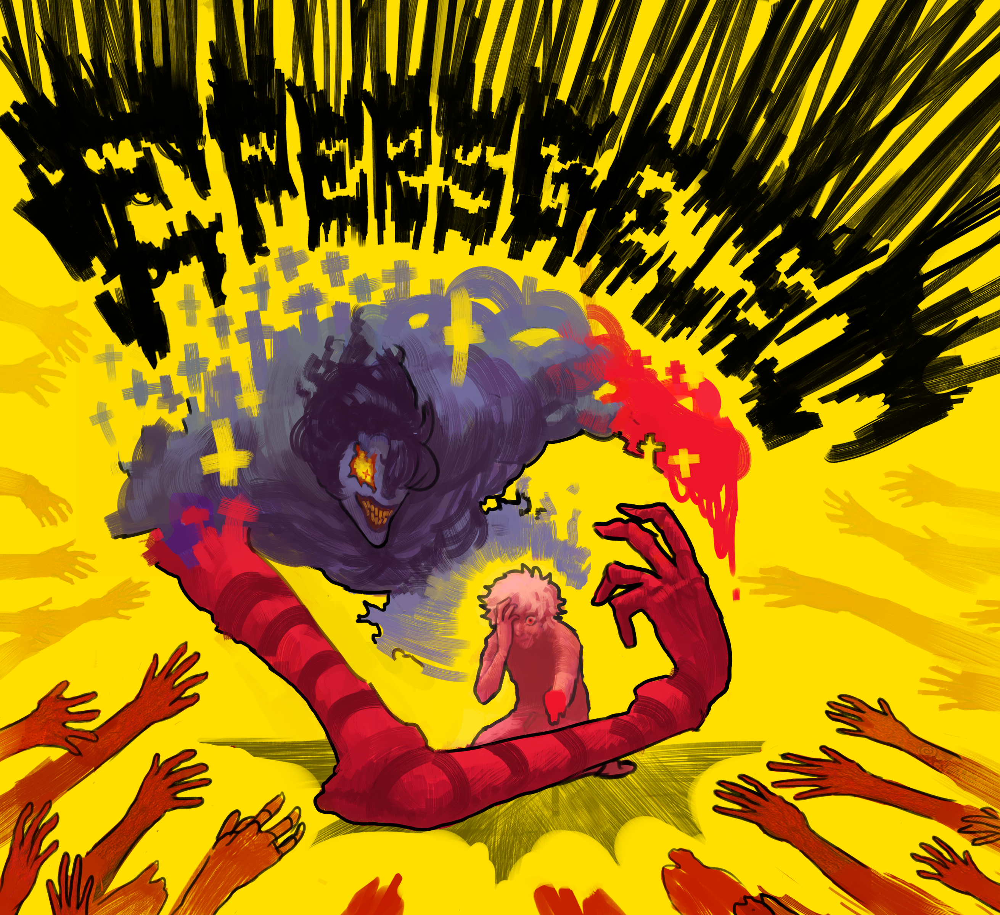

## Entregas
- [Entrega 1 - JDBC](enunciado/entrega1/entrega1.md)
- [Entrega 2 - ORM - Hibernate](enunciado/entrega2/entrega2.md)
- [Entrega 3 - ORM - Spring](enunciado/entrega3/entrega3.md)
- [Entrega 4 - NoSQL - Neo4j - Spring](/enunciado/entrega4/entrega4.md)
- [Entrega 5 - NoSQL - MongoDB - Spring](/enunciado/entrega5/entrega5.md)

## Ultima Integracion - Entrega 6 - RedisCache

Trabajo de Investigacion de la base de datos Redis, donde se deployo a servidores para su muestra, y se desarrollo un frontend con una interfaz grafica tipo mapa de la Universidad de Quilmes, donde todos los usuarios, pueden spawnear espiritus al mismo tiempo, utilizando Redis Pub/Sub + SSE.

## Enunciado inicial dado por la UNQ
> _Otro viernes en la facu, ¿nada raro, no?_
> _Cinco personas de informática y un ritual sin razón._
>
> _Con sal, velas y humo nos conectamos al más allá..._
> _y ahora las memorias del infierno nos vuelven a golpear._

Lo que en principio fue un viernes más en la universisdad derivó, de alguna manera, en un pseudo-ritual en el cual los cinco integrantes conectaron momentáneamente con seres de otros mundos, algunos de aspecto etéreo, otros antropomórficos, pero con claras características ajenas a los humanos.

Tras el corto estado eufórico de esa experiencia, los cinco programadores volvieron en sí, sentados en el living de la casa, atónitos ante lo visto.

Miradas desconcertadas volaron entre ellos durante unos minutos, pero todos comprendieron que ahora tenían una misión: representar a estos espectros en un modelo computable.

  

